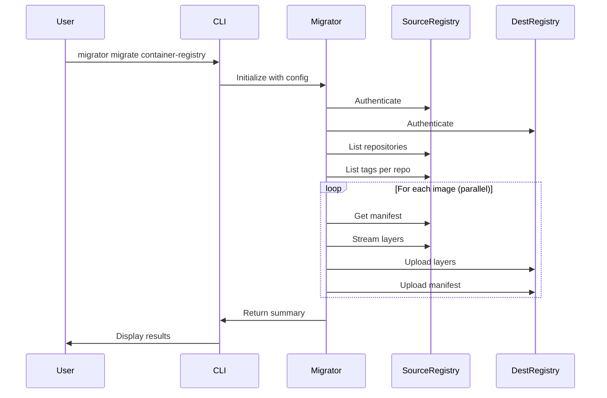

# Migrator

🚀 **A modular CLI application for efficient data migration between systems.**

[](https://www.python.org/downloads/)
[](https://opensource.org/licenses/MIT)

## Overview

 Migrator is a powerful, extensible CLI tool designed for migrating data between systems. The first supported migration type is **Container Registry Migration**, enabling efficient transfer of container images and Helm charts between any OCI-compliant registries.

### Key Features

- 🐳 **Container Registry Migration** - Migrate images and Helm charts between registries
- ⚡ **High Performance** - Direct HTTP API v2 transfers (no Docker daemon required)
- 🔄 **Parallel Processing** - Configurable parallel jobs and layer-level concurrency
- 🔁 **Resume Capability** - Continue interrupted migrations from checkpoint
- 💾 **Smart Caching** - Blob cache reduces redundant checks for shared layers
- 📊 **Beautiful CLI** - Animated progress bars, spinners, and summary reports
- 🎯 **Flexible Filtering** - Include/exclude patterns for selective migration
- 🔒 **Universal Registry Support** - Works with any OCI-compliant registry

### Supported Registries

| Registry | Tested | Notes |
|----------|--------|-------|
| Docker Hub | ✅ | Full support |
| Harbor | ✅ | Full support |
| Azure Container Registry (ACR) | ✅ | Full support |
| Amazon ECR | ✅ | Full support |
| Google Container Registry (GCR) | ✅ | Full support |
| Google Artifact Registry (GAR) | ✅ | Full support |
| GitHub Container Registry (GHCR) | ✅ | Full support |
| Quay.io | ✅ | Full support |
| Any OCI Registry | ✅ | Via standard API v2 |

## Installation

### From Source

```bash
# Clone the repository
git clone https://github.com/imaleek/migrator.git
cd migrator

# Create virtual environment
python -m venv venv
source venv/bin/activate  # Linux/Mac
# or
.\venv\Scripts\activate   # Windows

# Install in development mode
pip install -e ".[dev]"
```

### Dependencies

The tool automatically uses:

- **Direct Registry API v2** for container images (no Docker required)
- **Helm CLI** for Helm chart migration (Helm 3.8+ required)

## Usage

### Container Registry Migration

```bash
# Basic migration
migrator migrate container-registry \
    --source-registry harbor.old.io \
    --source-user admin \
    --source-password secret \
    --destination-registry harbor.new.io \
    --destination-user admin \
    --destination-password secret

# With filtering and parallel jobs
migrator migrate container-registry \
    --source-registry gcr.io/myproject \
    --source-user _json_key \
    --source-password "$(cat service-account.json)" \
    --destination-registry myregistry.azurecr.io \
    --destination-user myuser \
    --destination-password mytoken \
    --include "^production-" \
    --exclude ".*-dev$" \
    --parallel 8

# Dry run mode
migrator migrate container-registry \
    --source-registry source.registry.io \
    --source-user user \
    --source-password pass \
    --destination-registry dest.registry.io \
    --destination-user user \
    --destination-password pass \
    --dry-run

# Resume an interrupted migration (automatic)
migrator migrate container-registry \
    --source-registry source.registry.io \
    --source-user user \
    --source-password pass \
    --destination-registry dest.registry.io \
    --destination-user user \
    --destination-password pass
# Will automatically resume from last checkpoint if interrupted

# High performance with increased parallelism
migrator migrate container-registry \
    --source-registry source.registry.io \
    --source-user user \
    --source-password pass \
    --destination-registry dest.registry.io \
    --destination-user user \
    --destination-password pass \
    --parallel 10 \
    --layer-concurrency 5
```

### Command Options

```
Options:
  Source Registry:
    --source-registry, -sr    Source registry URL
    --source-user, -su        Source registry username
    --source-password, -sp    Source registry password
    --source-insecure         Allow HTTP connection
    --source-namespace, -sn   Source namespace/project prefix

  Destination Registry:
    --destination-registry, -dr    Destination registry URL
    --destination-user, -du        Destination registry username
    --destination-password, -dp    Destination registry password
    --destination-insecure         Allow HTTP connection
    --destination-namespace, -dn   Destination namespace/project prefix

  Migration Options:
    --parallel, -p            Parallel jobs (1-20, default: 4)
    --dry-run, -n             Simulate without changes
    --skip-existing           Skip existing images (default: true)

  Filtering:
    --include, -i             Regex to include repositories
    --exclude, -e             Regex to exclude repositories
    --skip-charts             Skip Helm chart migration (images only)
    --skip-images             Skip container image migration (charts only)

  Performance:
    --resume/--no-resume      Resume from checkpoint (default: enabled)
    --state-dir PATH          State file directory (default: .migrator-state)
    --layer-concurrency, -lc  Parallel layer transfers per image (1-10, default: 3)
    --scan-concurrency, -sc   Parallel repository scans (1-50, default: 10)

  Output:
    --verbose, -v             Enable verbose output
    --debug                   Enable debug logging
    --log-file PATH           Write logs to file (keeps console clean for progress)
```

> **Note**: Some registries (e.g., Huawei SWR Basic Edition) do not support OCI Helm charts. Use `--skip-charts` to migrate only container images.

### Helm Chart Detection

The tool identifies Helm charts using multiple methods:

- **Media types**: Standard CNCF Helm chart media types in config/layers
- **OCI annotations**: Detects charts with `description` containing "helm chart"
- **Config inspection**: Checks for Helm-specific config types

This ensures accurate detection even for charts stored in non-standard ways (e.g., Istio charts).

## Architecture

```
migrator/
├── src/
│   ├── main.py                    # CLI entry point (Typer)
│   ├── config.py                  # Pydantic configuration models
│   ├── console/
│   │   └── __init__.py            # Rich console UI components
│   ├── migrators/
│   │   ├── __init__.py            # Base migrator class
│   │   └── container_registry.py  # Container registry migrator
│   ├── services/
│   │   ├── registry_client.py     # Docker Registry API v2 client
│   │   ├── helm_client.py         # Helm OCI registry client
│   │   ├── migration_state.py     # State persistence for resume
│   │   └── blob_cache.py          # Blob caching service
│   └── utilities/
│       ├── exceptions.py          # Custom exception hierarchy
│       ├── logger.py              # Logging utilities
│       └── decorators.py          # Common decorators
├── tests/                         # Test suite (211+ tests)
├── pyproject.toml                 # Project configuration
└── README.md
```

### Extensibility

 Migrator is designed for extensibility. To add a new migration type:

1. Create a new migrator in `src/migrators/`
2. Extend `BaseMigrator` class
3. Add a new CLI command in `src/main.py`

Example:

```python
# src/migrators/database.py
from migrators import BaseMigrator

class DatabaseMigrator(BaseMigrator):
    @property
    def name(self) -> str:
        return "Database"
    
    async def discover(self):
        # Discover tables/data
        pass
    
    async def migrate_item(self, item):
        # Migrate single item
        pass
    
    async def run(self):
        # Execute migration
        pass
```

## Development

### Running Tests

```bash
# Run all tests
pytest

# With coverage
pytest --cov=src --cov-report=html

# Specific test file
pytest tests/test_registry_client.py -v
```

### Code Quality

```bash
# Linting
ruff check src/

# Type checking
mypy src/

# Format
ruff format src/
```

## Migration Flow



## License

MIT License - see [LICENSE](LICENSE) for details.

## Contributing

Contributions are welcome! Please read our contributing guidelines before submitting PRs.
