<p align="center">
  <h1 align="center">🚀 Migrator</h1>
  <p align="center">
    <strong>High-performance container registry migration tool</strong>
  </p>
  <p align="center">
    Efficiently migrate container images and Helm charts between any OCI-compliant registries
  </p>
</p>

<p align="center">
  <a href="https://www.python.org/downloads/"></a>
  <a href="https://opensource.org/licenses/MIT"></a>
  <a href="#"></a>
  <a href="#"></a>
</p>

---

## ✨ Features

- **🐳 Direct Registry Transfer** — No Docker/Helm daemon required. Uses Registry HTTP API v2 directly for maximum efficiency
- **⚡ Parallel Processing** — Configurable parallelism at both image and layer levels
- **🔄 Resume Capability** — Automatic checkpoint saving enables seamless recovery from interruptions
- **💾 Smart Blob Caching** — Reduces redundant checks for shared base layers across images
- **📊 Beautiful CLI** — Rich console UI with progress bars, spinners, and detailed summaries
- **🎯 Flexible Filtering** — Include/exclude patterns for selective migration
- **🔐 Universal Authentication** — Basic auth, Bearer tokens, and JWT support for all major registries
- **📦 Helm Chart Support** — Full OCI-based Helm chart migration alongside container images
- **🔁 Format Conversion** — Automatic OCI ↔ Docker manifest format conversion when needed
- **🏗️ Extensible Architecture** — Plugin-based design for adding new migration types

## 🎯 Supported Registries

| Registry | Status | Notes |
|----------|:------:|-------|
| **Docker Hub** | ✅ | Full support |
| **Harbor** | ✅ | Full support |
| **Azure Container Registry (ACR)** | ✅ | Full support |
| **Amazon ECR** | ✅ | Full support |
| **Google Container Registry (GCR)** | ✅ | Full support |
| **Google Artifact Registry (GAR)** | ✅ | Full support |
| **GitHub Container Registry (GHCR)** | ✅ | Full support |
| **Quay.io** | ✅ | Full support |
| **Huawei SWR** | ✅ | Images only (no OCI charts) |
| **Any OCI Registry** | ✅ | Via standard API v2 |

## 📦 Installation

### From Source (Recommended for Development)

```bash
# Clone the repository
git clone https://github.com/imaleek/migrator.git
cd migrator

# Create virtual environment
python -m venv venv
source venv/bin/activate  # Linux/macOS
# or
.\venv\Scripts\activate   # Windows

# Install with development dependencies
pip install -e ".[dev]"

# Verify installation
migrator --help
```

### Using pip

```bash
pip install migrator
```

### Standalone Binary (Linux)

Build a standalone executable using Docker:

```bash
# Build the binary
./build.ps1  # Windows PowerShell
# or
docker build -t migrator-builder . && docker cp $(docker create migrator-builder):/app/dist/migrator ./migrator

# Run
./migrator --help
```

### Requirements

 | Dependency | Purpose | Required |
 |------------|---------|:--------:|
 | **Python 3.10+** | Runtime | ✅ |
 | **No External Tools** | Native OCI | ✅ |

 > **Note**: Docker and Helm CLIs are **not required**. The tool uses the Registry HTTP API v2 directly for all operations.

## 🚀 Quick Start

### Basic Migration

```bash
migrator migrate container-registry \
    --source-registry harbor.old.io \
    --source-user admin \
    --source-password secret \
    --destination-registry harbor.new.io \
    --destination-user admin \
    --destination-password secret
```

### Dry Run (Preview Changes)

```bash
migrator migrate container-registry \
    --source-registry source.registry.io \
    --source-user user \
    --source-password pass \
    --destination-registry dest.registry.io \
    --destination-user user \
    --destination-password pass \
    --dry-run
```

### With Filtering

```bash
# Only migrate production images, exclude dev/test
migrator migrate container-registry \
    --source-registry gcr.io/myproject \
    --source-user _json_key \
    --source-password "$(cat service-account.json)" \
    --destination-registry myregistry.azurecr.io \
    --destination-user myuser \
    --destination-password mytoken \
    --include "^production-" \
    --exclude ".*-(dev|test)$" \
    --parallel 8
```

### High-Performance Migration

```bash
migrator migrate container-registry \
    --source-registry source.registry.io \
    --source-user user \
    --source-password pass \
    --destination-registry dest.registry.io \
    --destination-user user \
    --destination-password pass \
    --parallel 10 \
    --layer-concurrency 5 \
    --scan-concurrency 20
```

### Migrate Only Images (Skip Helm Charts)

```bash
migrator migrate container-registry \
    --source-registry source.registry.io \
    --source-user user \
    --source-password pass \
    --destination-registry dest.registry.io \
    --destination-user user \
    --destination-password pass \
    --skip-charts
```

### Migrate Only Helm Charts (Skip Images)

```bash
migrator migrate container-registry \
    --source-registry source.registry.io \
    --source-user user \
    --source-password pass \
    --destination-registry dest.registry.io \
    --destination-user user \
    --destination-password pass \
    --skip-images
```

## ⚙️ Command Reference

### `migrator migrate container-registry`

Main command for migrating container images and Helm charts.

#### Source Registry Options

| Option | Short | Description |
|--------|-------|-------------|
| `--source-registry` | `-sr` | Source registry URL (e.g., `harbor.io/project`) |
| `--source-user` | `-su` | Source registry username |
| `--source-password` | `-sp` | Source registry password |
| `--source-insecure` | | Allow HTTP (insecure) connection |
| `--source-namespace` | `-sn` | Source namespace/project prefix |

#### Destination Registry Options

| Option | Short | Description |
|--------|-------|-------------|
| `--destination-registry` | `-dr` | Destination registry URL |
| `--destination-user` | `-du` | Destination registry username |
| `--destination-password` | `-dp` | Destination registry password |
| `--destination-insecure` | | Allow HTTP (insecure) connection |
| `--destination-namespace` | `-dn` | Destination namespace/project prefix |

#### Migration Options

| Option | Short | Default | Description |
|--------|-------|---------|-------------|
| `--parallel` | `-p` | 4 | Parallel image migrations (1-20) |
| `--dry-run` | `-n` | false | Simulate without making changes |
| `--skip-existing` | | true | Skip images that already exist in destination |

#### Filtering Options

| Option | Short | Description |
|--------|-------|-------------|
| `--include` | `-i` | Regex pattern to include repositories |
| `--exclude` | `-e` | Regex pattern to exclude repositories |
| `--skip-charts` | | Skip Helm chart migration (images only) |
| `--skip-images` | | Skip container image migration (charts only) |

#### Performance Options

| Option | Short | Default | Description |
|--------|-------|---------|-------------|
| `--resume/--no-resume` | | enabled | Resume from checkpoint if interrupted |
| `--state-dir` | | `.migrator-state` | Directory for state files |
| `--layer-concurrency` | `-lc` | 3 | Parallel layer transfers per image (1-10) |
| `--scan-concurrency` | `-sc` | 10 | Parallel repository scans (1-50) |

#### Output Options

| Option | Short | Description |
|--------|-------|-------------|
| `--verbose` | `-v` | Enable verbose output |
| `--debug` | | Enable debug logging |
| `--log-file` | | Write logs to file (keeps console clean) |

### `migrator info`

Display system information and tool availability.

```bash
migrator info
```

## 🔄 How It Works

```mermaid
sequenceDiagram
    participant User
    participant CLI
    participant Migrator
    participant Source as Source Registry
    participant Dest as Destination Registry

    User->>CLI: migrator migrate container-registry
    CLI->>Migrator: Initialize with config
    
    rect rgb(40, 40, 80)
        Note over Migrator,Source: Discovery Phase
        Migrator->>Source: Authenticate
        Migrator->>Dest: Authenticate
        Migrator->>Source: List repositories
        Migrator->>Source: Get tags (parallel)
        Migrator->>Source: Inspect manifests
    end
    
    rect rgb(40, 80, 40)
        Note over Migrator,Dest: Migration Phase (parallel)
        loop For each image
            Migrator->>Dest: Check if exists (skip if so)
            Migrator->>Source: Get manifest
            Migrator->>Source: Stream layers (parallel)
            Migrator->>Dest: Upload layers
            Migrator->>Dest: Push manifest
            Migrator->>Migrator: Save checkpoint
        end
    end
    
    Migrator->>CLI: Return summary
    CLI->>User: Display results
```



### Key Concepts

#### Direct Registry Transfer

Unlike tools that pull images locally and push them, Migrator streams data directly from source to destination:

```
Source Registry → [Migrator] → Destination Registry
                    ↓
              (streaming, no local storage)
```

#### Smart Blob Caching

Base image layers (like `alpine:latest`) are often shared across many images. Migrator's blob cache tracks which blobs already exist in the destination, dramatically reducing redundant transfers:

```
Image A: [layer1, layer2, layer3]  ← layer1 uploaded
Image B: [layer1, layer4, layer5]  ← layer1 skipped (cached)
Image C: [layer1, layer2, layer6]  ← layer1, layer2 skipped (cached)
```

#### Resume Capability

Migration state is checkpointed to disk. If interrupted, simply run the same command again:

```bash
# First run (interrupted at 50%)
migrator migrate container-registry ...
# ^C

# Resume automatically continues from checkpoint
migrator migrate container-registry ...
# → Resuming migration: 500/1000 items already processed
```

## 🏗️ Architecture

```
migrator/
├── src/
│   ├── main.py                    # CLI entry point (Typer)
│   ├── config.py                  # Pydantic configuration models
│   ├── console/
│   │   └── __init__.py            # Rich console UI components
│   ├── migrators/
│   │   ├── __init__.py            # Base migrator class (ABC)
│   │   └── container_registry.py  # Container registry migrator
│   ├── services/
│   │   ├── registry_client.py     # Docker Registry API v2 client
│   │   ├── helm_client.py         # Helm OCI registry client
│   │   ├── migration_state.py     # State persistence for resume
│   │   └── blob_cache.py          # Blob existence caching
│   └── utilities/
│       ├── exceptions.py          # Custom exception hierarchy
│       ├── logger.py              # Rich logging utilities
│       └── decorators.py          # Common decorators
├── tests/                         # Comprehensive test suite (243+ tests)
├── pyproject.toml                 # Project configuration
├── Dockerfile                     # Multi-stage build for standalone binary
└── build.ps1                      # Windows build script
```

### Extending Migrator

Migrator is designed for extensibility. To add a new migration type:

1. Create a new migrator class extending `BaseMigrator`
2. Implement the required abstract methods
3. Add a CLI command in `main.py`

```python
# src/migrators/database.py
from migrators import BaseMigrator
from config import MigrationResult

class DatabaseMigrator(BaseMigrator):
    @property
    def name(self) -> str:
        return "Database"
    
    @property
    def description(self) -> str:
        return "Migrate database tables and data"
    
    async def validate_connection(self) -> bool:
        # Validate source and destination connections
        pass
    
    async def discover(self) -> list:
        # Discover tables/data to migrate
        pass
    
    async def migrate_item(self, item) -> MigrationResult:
        # Migrate a single table/record
        pass
    
    async def run(self):
        # Execute the complete migration
        pass
```

## 🧪 Development

### Setup

```bash
# Clone and install
git clone https://github.com/imaleek/migrator.git
cd migrator
pip install -e ".[dev]"
```

### Running Tests

```bash
# Run all tests
pytest

# With coverage report
pytest --cov=src --cov-report=html

# Run specific test file
pytest tests/test_registry_client.py -v

# Run tests matching a pattern
pytest -k "helm" -v
```

### Code Quality

```bash
# Linting
ruff check src/

# Type checking
mypy src/

# Formatting
ruff format src/

# All checks
ruff check src/ && mypy src/ && pytest
```

### Building Standalone Binary

```bash
# Windows (PowerShell)
.\build.ps1

# Using Docker directly
docker build -t migrator-builder .
docker create --name migrator-temp migrator-builder
docker cp migrator-temp:/app/dist/migrator ./dist/migrator
docker rm migrator-temp
```

## 🔧 Troubleshooting

### Common Issues

#### Authentication Failures

```
RegistryAuthenticationError: Authentication failed for registry.io
```

**Solutions:**

- Verify credentials are correct
- Check if the registry requires a specific username format (e.g., `_json_key` for GCR)
- Ensure the user has pull access on source and push access on destination

#### Manifest Format Errors

```
400 Bad Request: manifest invalid
```

**Solutions:**

- Migrator automatically attempts format conversion (OCI ↔ Docker)
- If the issue persists, check if the destination registry supports the manifest type
- Use `--debug` flag for detailed error information

#### Helm Chart Migration Fails

```
Helm clients not initialized
```

**Solutions:**

- Some registries (e.g., Huawei SWR Basic) don't support OCI charts; use `--skip-charts`

#### Connection Timeouts

```
Connection timeout
```

**Solutions:**

- Reduce `--parallel` and `--layer-concurrency` values
- Check network connectivity to both registries
- Use `--scan-concurrency 5` for slow registries

### Debug Mode

Enable detailed logging for troubleshooting:

```bash
migrator migrate container-registry \
    --source-registry source.io \
    --source-user user \
    --source-password pass \
    --destination-registry dest.io \
    --destination-user user \
    --destination-password pass \
    --debug \
    --log-file migration.log
```

## 📝 Environment Variables

| Variable | Description |
|----------|-------------|
| `MIGRATOR_SOURCE_PASSWORD` | Source registry password (alternative to CLI) |
| `MIGRATOR_DEST_PASSWORD` | Destination registry password (alternative to CLI) |

## 🤝 Contributing

Contributions are welcome! Here's how to get started:

1. **Fork** the repository
2. **Clone** your fork: `git clone https://github.com/YOUR_USERNAME/migrator.git`
3. **Create a branch**: `git checkout -b feature/amazing-feature`
4. **Make changes** and add tests
5. **Run tests**: `pytest`
6. **Commit**: `git commit -m 'Add amazing feature'`
7. **Push**: `git push origin feature/amazing-feature`
8. **Open a Pull Request**

### Guidelines

- Follow existing code style (enforced by `ruff`)
- Add tests for new functionality
- Update documentation as needed
- Keep commits focused and atomic

## 📄 License

This project is licensed under the MIT License - see the [LICENSE](LICENSE) file for details.

## 🙏 Acknowledgments

- [Rich](https://github.com/Textualize/rich) for beautiful terminal output
- [Typer](https://github.com/tiangolo/typer) for the CLI framework
- [httpx](https://github.com/encode/httpx) for async HTTP
- [Pydantic](https://github.com/pydantic/pydantic) for data validation

---

<p align="center">
  Made with ❤️ by the CrackTech Team
</p>
